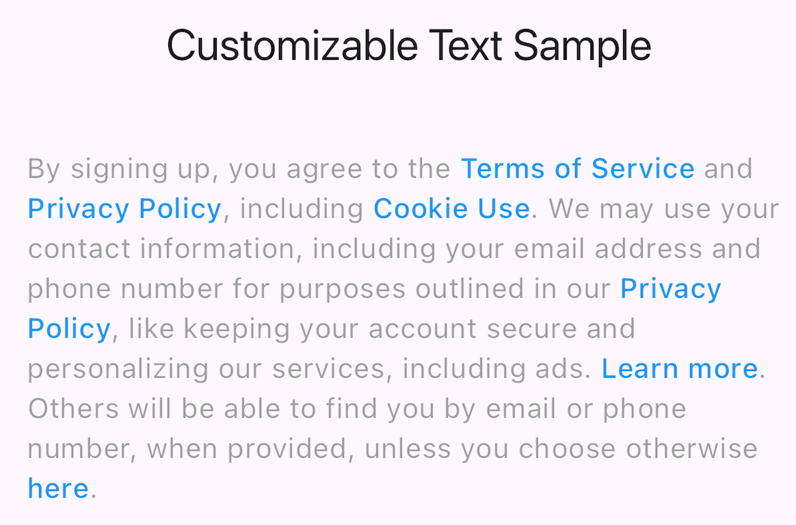
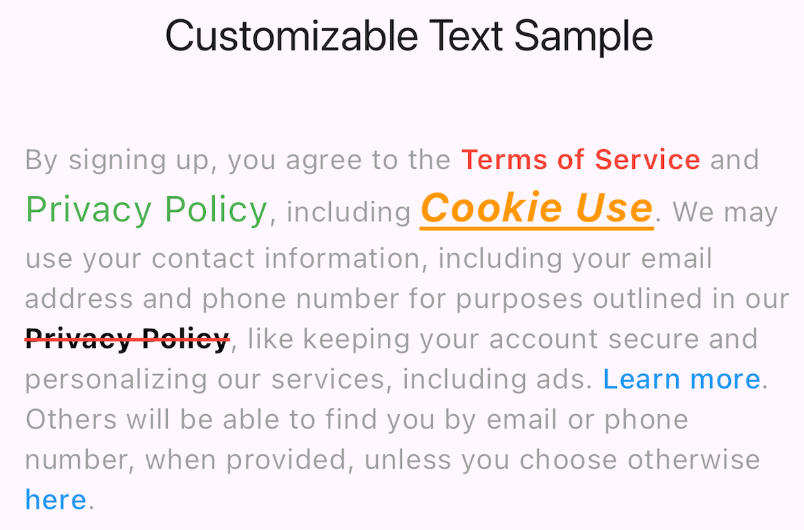
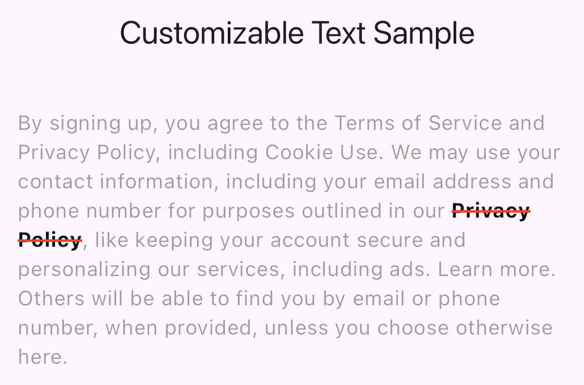

# Customizable Text

Customize a style of random words based on RichText.

## Installation

```yaml
dependencies:
  customizable_text: ^0.1.0
```

## Usage

### Basic usage



```dart
@override
Widget build(BuildContext context) {
  return Scaffold(
    appBar: AppBar(
      title: const Text("Customizable Text Sample"),
    ),
    body: Padding(
      padding: const EdgeInsets.all(24),
      child: CustomizableText(
        originalText,
        style: const TextStyle(
          color: Colors.grey,
        ),
        customStyle: const TextStyle(
          color: Colors.blue,
          fontWeight: FontWeight.w500,
        ),
        customizes: const [
          CustomText('Terms of Service'),
          CustomText('Privacy Policy'),
          CustomText('Cookie Use'),
          CustomText('Privacy Policy'),
          CustomText('Learn more'),
          CustomText('here'),
        ],
      ),
    ),
  );
}
```

### Dynamic customizing



```dart
@override
Widget build(BuildContext context) {
  return Scaffold(
    appBar: AppBar(
      title: const Text("Customizable Text Sample"),
    ),
    body: Padding(
      padding: const EdgeInsets.all(24),
      child: CustomizableText(
        originalText,
        style: const TextStyle(
          color: Colors.grey,
        ),
        customStyle: const TextStyle(
          color: Colors.blue,
          fontWeight: FontWeight.w500,
        ),
        customizes: [
          const CustomText(
            'Terms of Service',
            style: TextStyle(
              color: Colors.red,
              fontWeight: FontWeight.w600,
            ),
          ),
          CustomText(
            'Privacy Policy',
            style: const TextStyle(
              color: Colors.green,
              fontSize: 18,
            ),
            onTap: (text) => print(text),
          ),
          CustomText(
            'Cookie Use',
            style: const TextStyle(
              color: Colors.orange,
              fontSize: 20,
              fontWeight: FontWeight.bold,
              fontStyle: FontStyle.italic,
              decoration: TextDecoration.underline,
              decorationColor: Colors.orange,
            ),
            onTap: (text) => print(text),
          ),
          const CustomText(
            'Privacy Policy',
            style: TextStyle(
              color: Colors.black,
              fontWeight: FontWeight.bold,
              decoration: TextDecoration.lineThrough,
              decorationColor: Colors.red,
              decorationThickness: 2,
            ),
          ),
          const CustomText('Learn more'),
          const CustomText('here'),
        ],
      ),
    ),
  );
}
```

### Customize just for the second span word



```dart
@override
Widget build(BuildContext context) {
  return Scaffold(
    appBar: AppBar(
      title: const Text("Customizable Text Sample"),
    ),
    body: Padding(
      padding: const EdgeInsets.all(24),
      child: CustomizableText(
        originalText,
        style: const TextStyle(
          color: Colors.grey,
        ),
        customStyle: const TextStyle(
          color: Colors.blue,
          fontWeight: FontWeight.w500,
        ),
        customizes: const [
          CustomText(
            'Privacy Policy',
            span: 1,
            style: TextStyle(
              color: Colors.black,
              fontWeight: FontWeight.bold,
              decoration: TextDecoration.lineThrough,
              decorationColor: Colors.red,
              decorationThickness: 2,
            ),
          ),
        ],
      ),
    ),
  );
}
```

## License

[MIT](./LICENSE)
